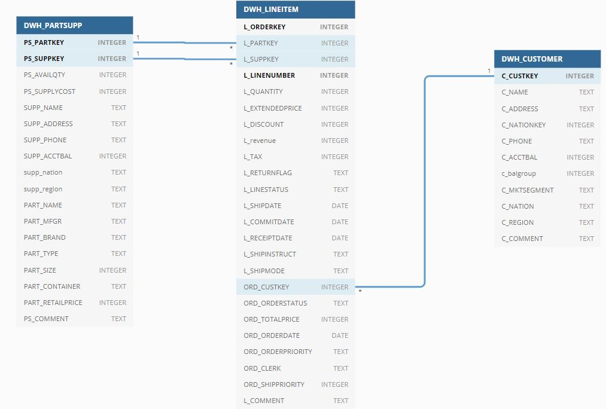

# Data Engineer Interview Test

Prospa is looking for a high quality data engineer which can deliver comprehensive solutions for our continuity and business growth. 

The Analytics team drives the data culture at Prospa, we want to change how we produce data from large batches to micro batching, from daily to near real-time/streaming processing, from tabular reports to insightful dashboards.    

You can be part of an amazing team which deals with data all the time using different process, tools and technologies.

Following is a little treasure and challenge for those keen on joining this amazing company and team.

# The Project
Build a small ETL process to digest a few set of files into a data warehouse like project. 

We are expecting an end-to-end ETL solution to deliver a simple star schema which an end user can easily slice and dice the data through a report or using basic ad-hoc query.

### Tools and Technologies
We are a Python and SQL workshop, we would like to see this project using just those tools.  

However, we are open to other tools and technologies if we are able to easily replicate on our side. 

For the database, use a simple and light optimizer for your database, choose the one which can run a browser, but don't be limited to it. 

Please, avoid licensed products, we may not be able to proceed with this restriction on our own, if this is the case you may need to book a meeting to bring your tool and demo to us. 

How to do it?
-----------------------
Fork this repo, build your ETL process and commit the code with your answers. Open a Pull Request and send us a message highlighting the test is completed.

#### Rules
* it must come with step by step instructions to run the code.
* please, be mindful that your code might be moved or deleted after we analyse the PR. 
* use the best practices
* be able to explain from the ground up the whole process on face to face interview

The small ETL project
--------- 

1. The data for this exercise can be found on the `data.zip` file. Can you describe the file format?
  - It is pipe separated table export.
**Super Bonus**: generate your own data through the instructions on the encoded file `bonus_etl_data_gen.txt`.
To get the bonus points, please encoded the file with the instructions were used to generate the files.
  - Updated the file with the instructions.

2. Code you scripts to load the data into a database.

	- Solution 
		- Created .dlayer.databaseconnection.databaseConnection class to wrap the database interface for all the processes.
		- In this solution I have used sqllite but databaseConnection class can be changed to support other databases.
		- With the help of .tp_configuration.util.load_config function, we are loading below configuration from .tp_configuration.configuration.yaml file.
			- file_path : location of the input data files.
			- file_name	: Name of files/tables in order of insert to the database.
			- filename_suffix : The suffix for files.
			- info_threshold : After how many insert a info logging should be created.
			- insert_query : Insert query for all the tables.
		- Script ./tp_loader.py is using above configuration to load the data into database. below script can be run to standalone run the loading process.
		
				` python tp_loader.py ` 

3. Design a star schema model which the data should flow.

	- Solution 
		- Created below schema by denormalizing the original schema.
			

4. Build your process to load the data into the star schema 

**Bonus** point: 
- add a fields to classify the customer account balance in 3 groups 
- add revenue per line item 
- convert the dates to be distributed over the last 2 years

	- Solution
		- Using .dlayer.databaseconnection.databaseConnection class process is connecting to sqllite database.
		- With the help of .tp_configuration.util.load_config function, we are loading below configuration from .tp_configuration/dwh_config.yaml file.
			- dwh_customer : Query to insert the records in dwh_customer table. Query is joining region, nation, customer tables to get the data.
			- dwh_partsupp : Query to insert the records in dwh_partsupp table. Query is joining region, nation, part, partsupp and supplier table.
			- dwh_lineitem : Query to insert the records in dwh_lineitem table. Query is joining lineitem and orders table.
		- The dwh_customer table has added column for 3 groups for account balance (dwh_customer.c_balgroup).
		- The dwh_lineitem table has added column for revenue per line item (dwh_customer.c_balgroup).
		- Script ./dwh_loader.py is using above configuration to load the data into dwh tables.
		
				` python dwh_loader.py `

5. How to schedule this process to run multiple times per day?
	- Solution
		- Created the luigi schedular tasks to manage the depedency between below three tasks.
			- Get the input file and load into database
			- Load the data to star schema.
			- Create report on top of star schema.
		- In current configuration first two task will run once a day.
		- We can add luigi script in crontab to run like every hour to generate the reports, only once a day it will load the data in database.
		
 
**Bonus**: What to do if the data arrives in random order and times via streaming?
		- Instead of batch we can use opesource stream processing engines to process and transform the streaming data.
		- If the time window for random order and time is large, my suggestion will be to go via batch processing as we will not be able to reach completness for real time aggregation and reporting.
		

6. How to deploy this code?
	- Solution
		- As I mention above the processes can be scheduled using schedulars like luigi or Airflow.
		- The schedular can be configured to run on containers e.g. for luigi we need to crontab the schedular on dockers.

**Bonus**: Can you make it to run on a container like process (Docker)? 

Data Reporting
-------
One of the most important aspects to build a DWH is to deliver insights to end-users. Besides the question bellow, what extra insights you can think of can be generated from this dataset?

Can you using the designed star schema (or if you prefer the raw data), generate SQL statements to answer the following questions:

  - Solution
	- Created module ./report_generator.py to generate the reports and reports can be found under ./report/ directory.
	- Please find inline query and output against each line item.
	- Extra insights :
		- Top Countries with bilateral trade or trade deficit.
		- Supplier with minimum cost of part.
		- supplier or part with most returned orders.

1. What are the top 5 nations in terms of revenue?

		

			SELECT ps.supp_nation,
			Round(Sum(l.l_revenue), 4) AS revenue
			FROM   dwh_lineitem l
			JOIN dwh_partsupp ps
			ON l.l_partkey = ps.ps_partkey
			AND l.l_suppkey = ps.ps_suppkey
			GROUP  BY ps.supp_nation
			ORDER  BY revenue DESC
			LIMIT  5;

	
Nation         | Revenue
--- | ---
UNITED STATES  | 164414923.6019
CHINA          | 146615727.9154 
MOZAMBIQUE     | 139965572.2776
VIETNAM | 123401005.7742
EGYPT | 121943744.3883

2. From the top 5 nations, what is the most common shipping mode?

			
			
			WITH top_rev_nation AS 
			( 
					 SELECT   ps.supp_nation, 
							  Round(Sum(l.l_revenue),4) AS revenue 
					 FROM     dwh_lineitem l 
					 JOIN     dwh_partsupp ps 
					 ON       l.l_partkey = ps.ps_partkey 
					 AND      l.l_suppkey = ps.ps_suppkey 
					 GROUP BY ps.supp_nation 
					 ORDER BY revenue DESC limit 5) 
			SELECT   l.l_shipmode, 
					 Count(1) AS count_ship 
			FROM     dwh_partsupp ps 
			JOIN     dwh_lineitem l 
			ON       l.l_partkey = ps.ps_partkey 
			AND      l.l_suppkey = ps.ps_suppkey 
			AND      ps.supp_nation IN 
					 ( 
							SELECT supp_nation 
							FROM   top_rev_nation) 
			GROUP BY l.l_shipmode 
			ORDER BY count_ship DESC limit 5
			
			
Shipping Mode | Count of Shipment
--- | ---
	TRUCK | 3000
	MAIL | 2968
	REG AIR | 2948
	AIR | 2922
	RAIL  | 2903
			
			
			

3. What are the top selling months?

	
			SELECT Strftime('%m', l.ord_orderdate) AS month, 
				   Strftime('%Y', l.ord_orderdate) AS year, 
				   Count(1)                        AS sell_count 
			FROM   dwh_lineitem l 
			GROUP  BY month, 
					  year 
			ORDER  BY sell_count DESC 
			LIMIT  5 
	
Month | Year | Number of orders
--- | --- | ---
	01 | 1994 | 876
	12 | 1993 | 872
	05 | 1994 | 853
	09 | 1993 | 849
	12 | 1995 |846
	

4. Who are the top customer in terms of revenue and/or quantity?

			SELECT c.c_name, 
				   Round(Sum(l.l_revenue), 4) AS revenue 
			FROM   dwh_lineitem l 
				   JOIN dwh_customer c 
					 ON l.ord_custkey = c.c_custkey 
			GROUP  BY c.c_name 
			ORDER  BY revenue DESC 
			LIMIT  5 
			
Customer Name | Revenue created by customer
--- | ---
Customer#000001489 | 5203674.0537
Customer#000000214 | 4503703.9036
Customer#000000073 | 4466381.0513
Customer#000001246 | 4465335.6222
Customer#000001396 | 4455381.8182
			
			
			
			SELECT c.c_name, 
				   Sum(l.l_quantity) AS quantity 
			FROM   dwh_lineitem l 
				   JOIN dwh_customer c 
					 ON l.ord_custkey = c.c_custkey 
			GROUP  BY c.c_name 
			ORDER  BY quantity DESC 
			LIMIT  5 

			
Customer Name | Ordered Quantity
--- | ---
Customer#000001489 | 3868
Customer#000001396 | 3408
Customer#000000073 | 3384
Customer#000000214 | 3369
Customer#000000898 | 3309

5. Compare the sales revenue of on current period against previous period?

			WITH rev_per_mont AS 
			( 
					 SELECT   Strftime('%m',l.ord_orderdate)              AS month, 
							  Cast(Strftime('%Y',l.ord_orderdate) AS INT) AS year, 
							  Sum(l.l_revenue)                            AS revenue 
					 FROM     dwh_lineitem l 
					 GROUP BY month, 
							  year ) 
			SELECT   cur.month, 
					 cur.year , 
					 Round(cur.revenue,4 ) , 
					 Round(pre.revenue,4), 
					 pre.year, 
					 Round(cur.revenue-pre.revenue,4) diff_frm_last 
			FROM     rev_per_mont cur 
			JOIN     rev_per_mont pre 
			ON       cur.month = pre.month 
			AND      cur.year - 1 = pre.year 
			ORDER BY cur.year limit 10
			
			
Month | Year | Current period revenue | Previous period revenue | Previous Year | Difference in Revenue
--- | --- | --- | --- | --- | ---
01 | 1993 | 24753231.5263 | 29253389.6627 | 1992 | -4500158.1364
02 | 1993 | 24855018.6369 | 23707595.2813 | 1992 | 1147423.3556
03 | 1993 | 23557904.426  | 28292976.7845 | 1992 | -4735072.3585
04 | 1993 | 25303870.929  | 26663200.5775 | 1992 | -1359329.6485
05 | 1993 | 27447758.9238 | 26430796.3036 | 1992 | 1016962.6202
06 | 1993 | 24350293.5602 | 24027814.3652 | 1992 | 322479.195
07 | 1993 | 25126613.1494 | 25344993.1775 | 1992 | -218380.0281
08 | 1993 | 25702903.18   | 27862035.7818 | 1992 | -2159132.6018
09 | 1993 | 28765084.253  | 26375607.9517 | 1992 | 2389476.3013
10 | 1993 | 29558233.359  | 25569894.3717 | 1992 | 3988338.9873
                                        

Data profilling
----   
Data profiling are bonus.

What tools or techniques you would use to profile the data?

	- We can use profiling modules in python like panda_profiling.
	- we can also use pandas with seaborn/matplot lib to explore the data.
 
What results of the data profiling can impact on your analysis and design?
	- Profiling of data can help in indetifing below.
		- Type of data 
		- If data is categorical than unique categories.
		- Missing values in data.
		- Descriptive statistics like mean, mode, skewness
		- Relationship between columns (co-relation)

Architecture
-----
If this pipeline is to be build for a real live environment.
What would be your recommendations in terms of tools and process?

	- Load to the database :
		- We can expose webservies to application managing orders and shipping.
		- On webservice call we can insert the lineitem and orders table, and update the customer and partsupp table.

	- Load to dataware house :
		- If select load is not an issue on database, we can create stream on database tables using spark structured streaming.
			- when the new insert or update will done on database, same will be subscribed to dwh tables.
			- On top of that using streaming we can generate near-real-time dash board displaying items like number of part sold in last 1 hour, revenue in last 2 hour etc.
		
		- If select load is an issue on database, we can have load webservice (mentioned in first point) push the same data to a messsage queue.
			- Using Spark streaming we can subscribe to the messaging queue to get the input data for dwh.
			
	- Reporting : 
		- Most of the reporting will be done using spark cluster created for streaming for batch processing.
		- Opeartional critical information can be publish on live dashboard near-real-time using streaming and web sockets.
		
		

Would be a problem if the data from the source system is growing at 6.1-12.7% rate a month?

	- 

ERD
--

Author: adilsonmendonca
